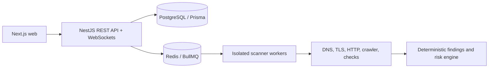

# Sentinel

Sentinel is a security monitoring and vulnerability assessment platform for authorized assets. This repository is an Nx monorepo with a Next.js dashboard, NestJS API, Prisma data model, and local PostgreSQL/Redis infrastructure.

## Current foundation

- Next.js dashboard shell with score, finding, asset, and scan posture views
- NestJS API with CORS configuration and `/api/health`
- Argon2 authentication with JWT access tokens, rotating hashed refresh sessions, logout, and DTO validation
- Password reset tokens are hashed, expiring, single-use, and revoke active sessions after reset
- Workspace membership checks with OWNER, ANALYST, and VIEWER role ordering
- Owner-only member administration with last-owner protection and audit logging
- Workspace-scoped assets with DNS TXT verification and public-target validation
- BullMQ-backed scan creation with verified-asset gates and a separate scanner worker
- Safe scanner checks for DNS resolution, HTTPS availability, and security headers
- Workspace-scoped JSON and CSV security reports generated from completed scans
- Daily, weekly, and monthly scheduled scans with pause/resume controls
- Swagger/OpenAPI documentation at `/api/docs`
- GitHub Actions validation with PostgreSQL, Redis, migrations, builds, tests, and audit checks
- Prisma schema for users, sessions, workspaces, members, assets, scans, findings, and immutable audit records
- Workspace-scoped uniqueness and indexes for the primary access-control boundaries
- Docker Compose services for PostgreSQL 16 and Redis 7
- Jest test targets and production builds for both applications

## Architecture



## Local development

Prerequisites: Node.js 22+, npm, and Docker Desktop.

```sh
cp .env.example .env
npm install
npm run db:generate
docker compose up -d
npm run dev:web
```

In another terminal, run the API:

```sh
npm run dev:api
```

The dashboard runs at `http://localhost:3000`. The API health endpoint is `http://localhost:3001/api/health`.

## Verification

```sh
npm run db:generate
npx nx run-many -t build test --projects=web,api --outputStyle=static
```

## Roadmap

See [docs/implementation-status.md](docs/implementation-status.md) for the current phase matrix and remaining production work.

See [docs/how-it-works.md](docs/how-it-works.md) for local startup, request flow, scan processing, and production operation.

1. Email verification and session management UI
2. TLS certificate checks, controlled crawler, endpoint discovery, and scan cancellation
3. Scope validation with DNS pinning, worker network isolation, and aggressive-mode authorization
4. Historical scan results and diff engine
5. Notification email/webhooks, S3 report storage, and observability
6. Integration/E2E coverage and cloud deployment hardening
7. AI explanations grounded in deterministic finding evidence

Security-sensitive behavior is implemented incrementally. Active and aggressive scanning will require verified ownership and explicit authorization, with strict scope and network safeguards before worker functionality is enabled.
