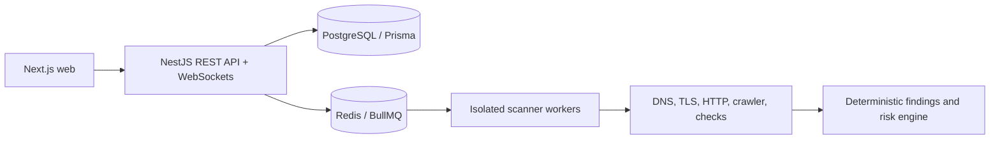

# Sentinel

Sentinel is a security monitoring and vulnerability assessment platform for authorized assets. This repository is an Nx monorepo with a Next.js dashboard, NestJS API, Prisma data model, and local PostgreSQL/Redis infrastructure.

## Current foundation

- Next.js dashboard with live Overview, assets, scans, findings, reports, and schedules
- NestJS API with CSRF, CORS, WebSockets, `/api/health`, `/api/ready`, and `/api/metrics`
- Argon2 authentication, JWT access tokens, rotating hashed refresh sessions, and SMTP verify/reset mail
- Workspace membership with OWNER, ANALYST, and VIEWER roles and audited mutations
- Workspace-scoped assets with DNS TXT verification and public-target validation
- Isolated scanner worker with SAFE/NORMAL/AGGRESSIVE profiles (DNS, TLS, HTTP, crawler, discovery)
- Stripe checkout, webhooks, and workspace billing reconcile
- Swagger/OpenAPI documentation at `/api/docs`
- GitHub Actions validation with PostgreSQL, Redis, migrations, builds, tests, Playwright, and audit checks
- Production Compose stack: web, API, scanner, Postgres, Redis, and Nginx

## Architecture



## Local development

Prerequisites: Node.js 22+, npm, and Docker Desktop.

```sh
cp .env.example .env
npm install
npm run db:generate
docker compose up -d
npm run dev:web
```

In another terminal, run the API:

```sh
npm run dev:api
```

The dashboard runs at `http://localhost:3000`. The API health endpoint is `http://localhost:3001/api/health`.

## Production

```sh
cp .env.production.example .env.production
# Set POSTGRES_PASSWORD, DATABASE_URL (same password), JWT secrets, and WEB_ORIGIN
docker compose --env-file .env.production -f docker-compose.prod.yml up -d --build
```

Nginx serves the dashboard on port 80 and proxies `/api/` plus `/socket.io/` to the API. Open `http://localhost`. Stripe and SMTP are optional; leave those variables empty for a first run.

## Verification

```sh
npm run db:generate
npx nx run-many -t build test --projects=web,api --outputStyle=static
```

## Roadmap

See [docs/implementation-status.md](docs/implementation-status.md) for what is shipped and what is still open.

See [docs/how-it-works.md](docs/how-it-works.md) for local startup, request flow, scan processing, and production operation.

Still open:

1. Finding-resolved notifications, plus email/Slack/Discord/webhook adapters
2. Raw DNS/TLS/HTTP history beyond finding diffs, and S3 report storage
3. Scanner egress policy, HTTPS cookie/session hardening, and cloud deploy
4. Deeper integration/E2E coverage through scanner completion
5. AI explanations grounded in deterministic finding evidence

Security-sensitive behavior is implemented incrementally. Active and aggressive scanning require verified ownership, with strict scope and network safeguards in the worker.
